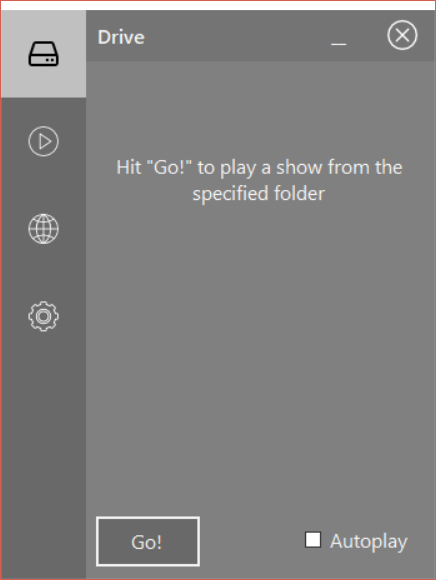
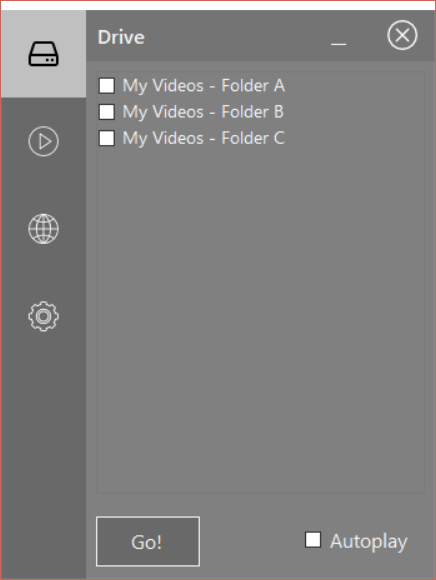
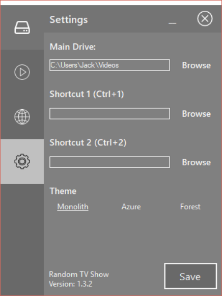
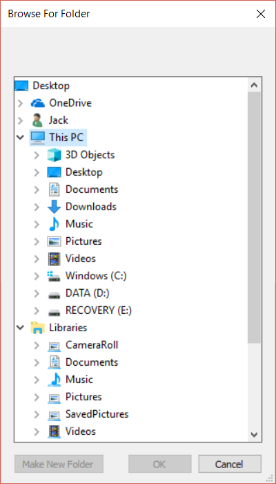
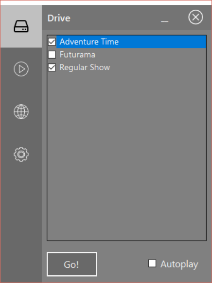

## Initial Setup

Setting up the Random TV Show application is incredibly simple. It involves pointing the app towards a maximum of three folder paths (if you intend on using both shortcuts), and then you're good to go.

When you start the app it will set the user's My Videos folder as the default video root folder. Your application will likely look like either of the shots below:

If all the files you wish to pick from are contained in My Videos then *great*, you're all set! If you're like me and your videos are contained elsewhere then we have a slight bit of tweaking to do.

Click the gear icon four items down the left-hand menu - this represents the settings tab. You should see the same layout as below (where `Jack` is switched for your own user account):

Here you can change either change the folder path specified in the first textbox manually to change your root folder, or click the **Browse** button to select a folder. The list you have to select from can be a bit confusing if your folder isn't on your desktop, so I've included an image of where the drives and your personal folders are in the list:

Once the top textbox is pointed at your desired folder, *hit the save button*. You can also set the textboxes below to use as quick shortcuts, for if you know exactly which folder you're most likely to pick (mine is aimed at my Adventure Time folder). Pick the theme you like the best (please suggest a new one if you think mine are rubbish), and *hit save again*.

Clicking on the drive icon at the top of the menu will take you back to the **Drive** tab. It should now be populated with folders like so:

Select the folders you wish to pick from, decide if you would like shows to Autoplay (a new video starts immediately after the previous one finishes), and hit the **Go** button! The app will take you to the **Player** tab and a random video will start playing! If you don't like the one it has picked, there's a **Reroll** button at the bottom of this tab, which starts a new video.

Look at you go! You're all set up. Please feel free to make any suggestions in the [Issues page](https://github.com/JackEvans24/random-tv-show/issues) of this repository, or let me know of any feedback you have - I'm always looking for ways to improve. 

Enjoy watching videos on shuffle!
